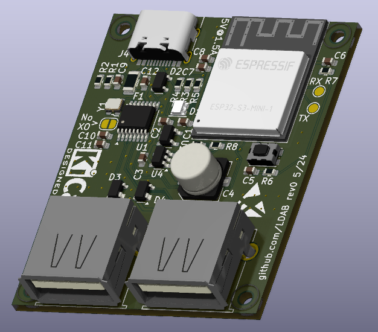
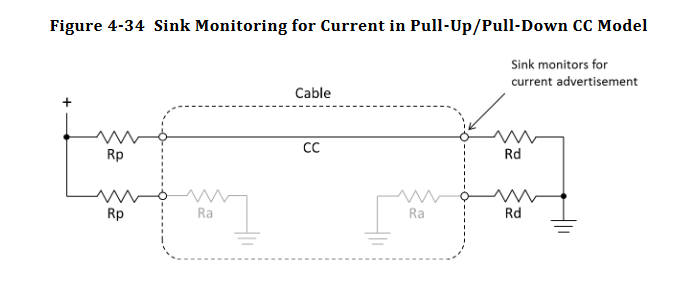
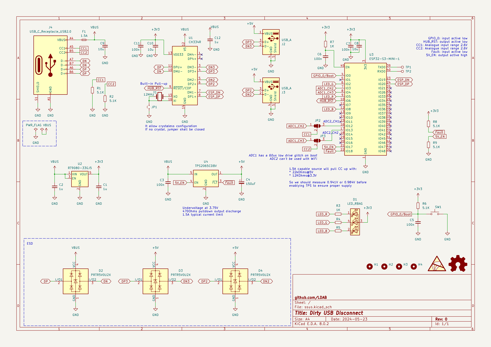

# dude-dirty-usb-disconnect

[](https://github.com/ldab/dude-dirty-usb-disconnect/releases/latest)

[](https://github.com/ldab/dude-dirty-usb-disconnect/blob/master/LICENSE)

[](https://github.com/ldab/dude-dirty-usb-disconnect)

<p align="center">
  
</p>

## Todo

- [ ] WebBle
- [ ] Get a PID from https://pid.codes/howto/
- [ ] There is some overflow around the help print for the `hub_settings`
- [x] `sdkconfig.default` for release with CDC (no jtag)

## Why?

I needed something to remotely disconnect and reconnect an USB device from my workstation, aka managed USB hub, the commercially available options where either [expensive](https://www.usbgear.com/managed-hubs.html) or needed [drivers](https://www.yepkit.com/products/ykush). So the idea here is an device that does not need external power and works as a USB CDC-ACM and one can simply send `hub_ports_off` over the terminal to turns the USB ports off.

## How?

As per USB-C [standard](https://www.usb.org/sites/default/files/USB%20Type-C%20Spec%20R2.0%20-%20August%202019.pdf), if you are bored read section 4.6.2.1, an USB-C source device should at least source 1.5A, as it is written:

  > All exposed USB Type-C Current ports shall have the ability to offer the same power capabilities. 
  > - All ports shall initially offer 1.5 A.

With that being said we can use the HUB with USB2.0 devices (500mA) with no problems. The device monitor the CC pins and it can detect if the source is able to provide the minimum required current (1.5A):

<p align="center">
  
</p>

**Table 4-36** indicates that a minimum of 0.7V should be read on CC for a 1.5A capable source, so we should be good with a USB-C to USB-C cable.

If you have an old laptop like me and it does not have an USB-C port, one can override the source check and send `hub_setings override_cc 1` and the HUB ports will be enabled even if the source does not provide enough power. On that case you may experience some weirdness on the final USB device, but hey, if you are here, you should have some idea of what you are doing.

One can also issue `hub_status` and see what the status is, for example:

```
dirty_usb_disconnect> hub_status
FW version: v0.0.1a
Hub is: Enabled
Fault: None
USB Host does not provide 1.5A
```

The CDC-ACM USB driver is based on espressif [example](https://github.com/espressif/esp-idf/tree/v5.2.1/examples/system/console/basic), you will find how it works there... the PID is 0x303A and VID is 0x0009. In case you are building the `debug` version the output will be over the USB-JTAG controller, PID:VID 0x303A:0x1001 (here you can also debug over USB, cool :smile:)

## Available commands

* Type `help` on the terminal

## Hardware 

- Device itself draws ~40mA;

<p align="center">
  
</p>

## Note

- The hub controller datasheet indicates a internal pullup on RST, but it seems something is going on there, so next revision needs an external pull up, for now: https://github.com/ldab/dude-dirty-usb-disconnect/blob/4d217c8b5ad06fc77f75e4162ce3a6a554248eb0/components/app_hub_control/app_hub_control.c#L406

## Outro

- Some 3D models from: www.3dcontentcentral.com
